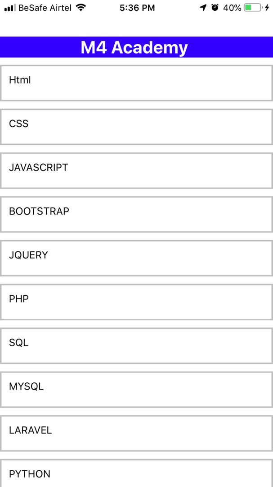
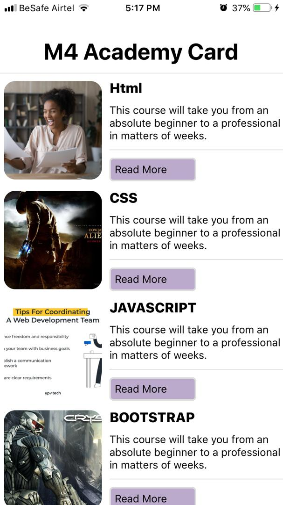

# M4 Academy App

    

    

BasicCard is an iOS/Android app that allows that was built using reactnative.

This is a basic project that every reactnative should try doing, if you are here, then i believe that you are taking my reactnative course

## More About App

The app teaches you about component, how to load static images dynamically with reactnative, how to work with functions,
how to pass props from parent to child, how to change screens and so on.
It a fun app to develop and take your skill to another level

## Developer

This App was developed by Miracle Adolphus (M4) the Instructor and Owner of M4 Academy
